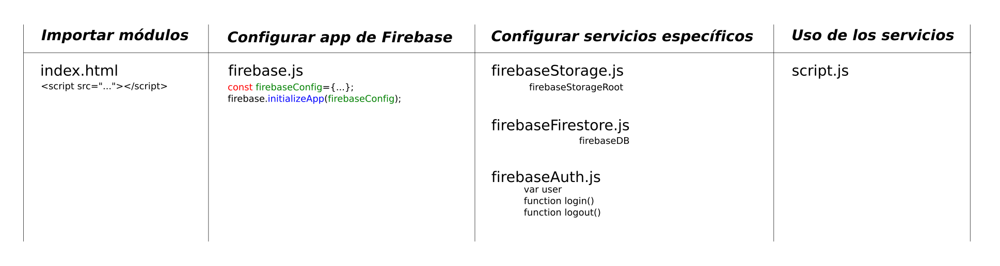

# Pruebas de Firebase en Web

## Servidor de prueba
```bash
$ python -m SimpleHTTPServer 8000
```
## Esquema ficheros
Finalidad de los diferentes ficheros y objetos (variables, funciones) globales que proporcionan.


## Referencias

1. [Módulos de CDN para los diferentes servicios](https://firebase.google.com/docs/web/setup?authuser=0#libraries_CDN)