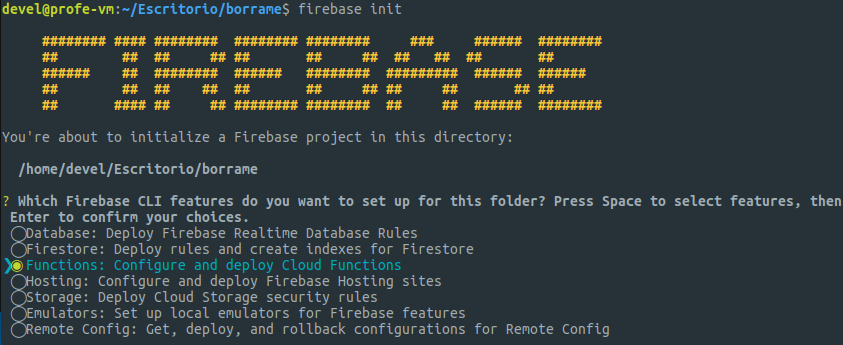
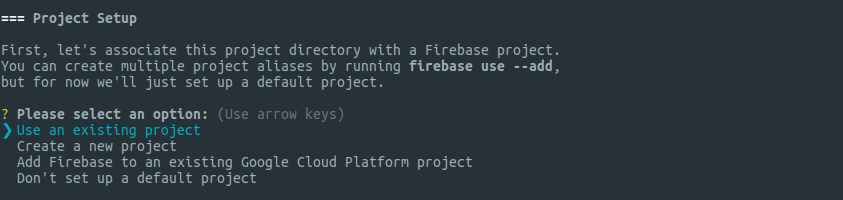
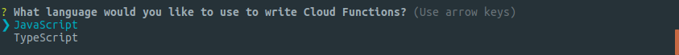
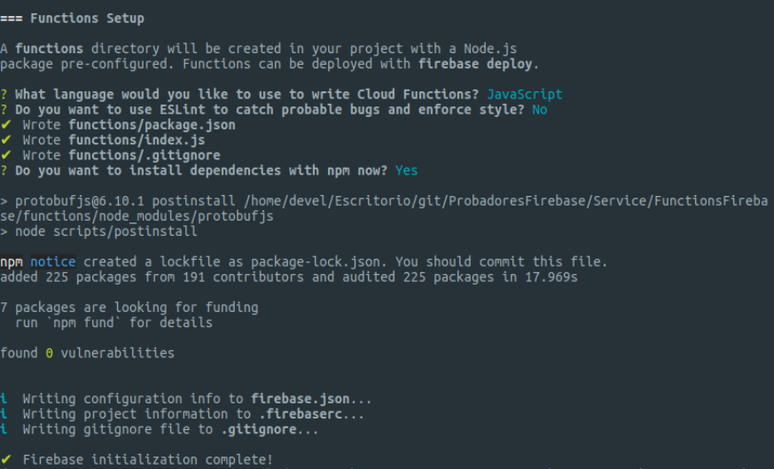
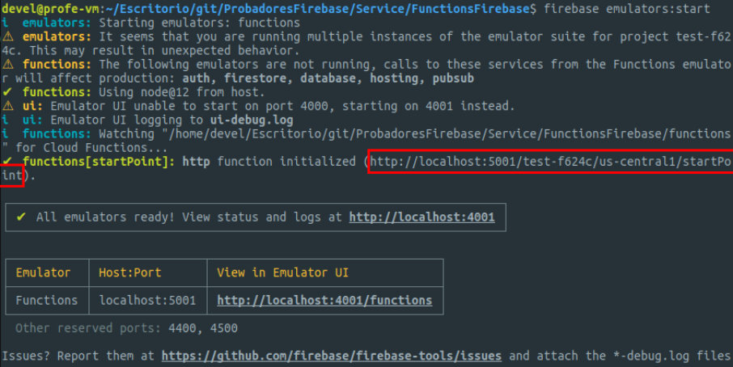
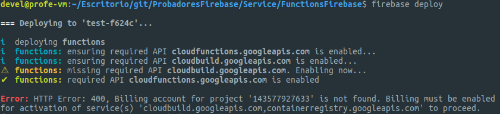
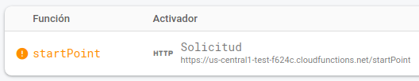

# De Express a Firebase Functions

## Creación del proyecto de Firebase Functions.

Emplearemos Firebase CLI para iniciar un proyecto para Functions.

Crearemos una carpeta nueva y en ella ejecutaremos:

```bash
$ firebase init
```

Seleccionaremos las respuestas tal y como se muestra en el ejemplo:






## Trasvase de los endpoints a Firebase Functions

Completado el proceso anterior, hemos de pasar nuestra funciones de Express al fichero functions/index.js que ha sido creado por la inicializacion.

Recuerda sustituie la llamada a `app.listen` por una llamada a `https.onRequest` para que sea Firebase en lugar de Express quien se encargue de escuchar las peticiones.

## Probamos nuestra API

Usamos el emulador de Firebase CLI para comprobar que todo funciona.

```bash
$ firebase emulators:start
```
Durante la ejecución del emulador nos indicarán la URL a emplear para las pruebas. A esa URL tendremos que añadirle el endpoint a probar.



Para el ejemplo de la ilustración necesitaríamos usar `http://localhost:5001/test-f624c/us-central1/startPoint/ping/` para probar el endpoint *GET /ping/*.


## Publicando nuestra API

Una vez todo está en orden y funcionando, es el momento de publicarla en Firebase:

```bash
firebase deploy
```

### Error 'Billing account'



Dependiendo de la localización geográfica de tu proyecto se puede porducir un error que te indique que has de proporcionar una cuenta de facturación. Para solucionarlo, edita el fichero `./functions/package.json` y modifica la versión de Node a la 8:

```json
"node": "8",
```

Repite el comando de `deploy`.

## URL para el acceso a la API

Accede al proyecto en tu consola de Firebase. En el panel de functions tendrás la URL en la que tu API estará disponible.



Recuerda añadir la ruta del endpoint al final de la URL proporcionada.

