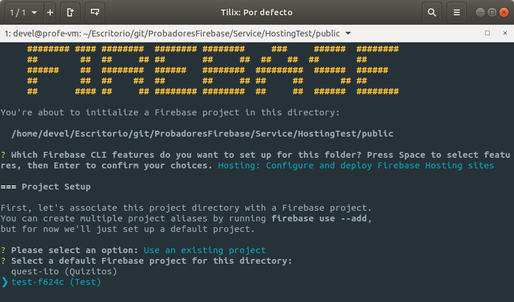

# Publicando un proyecto de Svelte en Firebase Hosting

Vamos a publicar un proyecto de Svelte en Firebase hosting para hacerlo accesible públicamente en internet.

:warning: **Consideraciones de seguridad**: Al publicar tu aplicación podría ser empleada potencialmente por cualquiera. Eso puede implicar cargos por consumo o filtraciones de datos si no hemos ajustado adecuadamente los parámetros **Rules** de nuestros proyectos.

Recuerda que los proyectos de Svelte necesitan ser compilados antes de ser funcionales, así que el proceso constará básicamente de cuatro pasos:

* **Iniciaclización** del proyecto para Firebase Hosting
* **Compilación** de la aplicación de Svelt.
* **Prueba** de la aplicación en local.
* **Publicación** de la aplicación.

## Inicializando el proyecto.

Abre un terminal en la carpeta del proyecto de Svelte y teclea:

```bash
$ firebase init
```


Usa las teclas de cursor ***flecha arriba*** y ***flecha abajo*** para moverte por las opciones que te ofrece.

Usa la ***barra espaciadora*** para marcar o desmarcar las opciones.

Marca la opción **Hosting** y pulsa ***Intro*** para continuar.


Selecciona **Use an existing project** y pulsa ***Intro*** para continuar.



Selecciona el proyecto adecuado y continúa.


Pulsa ***Intro*** para confirmar que es la carpeta *public* la que contiene el contenido que queremos publicar. En esta carpeta es en donde se almacenará el resultado de la compilación del proyecto de Svelte.

Contesta con ***Y*** a la pregunta "*Configure as a single page*", pues Svelte genera "*Single Page Applications*".

Contesta con ***Intro*** o con ***N*** a la pregunta "*Set up automatic builds*".

Firestart CLI ha configurado tu proyecto de Svelt.

## Compilación

Emplea los script de Svelte para compilar el proyecto:

```bash
$ npm run build
```
## Prueba

Inicia los *servicios de emulación de Firebase* para probar tu proyecto antes de publicarlo.

Asegurate de no tener el servidor de desarrollo de Svel funcionando, pues usa el mismo puerto que el servicio de emulacion de Firebase.

Desde la carpeta del proyecto:

```bash
firebase emulators:start
```


Accede a tu proyecto desde el navegador en la direccion: [http://localhost:5000](http://localhost:5000)

Cuando ya no los necesites, deten los servicios de emulación pulsando *Ctrl+C* en el terminal en el que los has ejecutado.

## Publicando

Vamos a subir nuestro proyecto a Firebase Hosting.

Desde la carpeta del proyecto:

```bash
$ firebase deploy
```


Una vez termine el proceso de despliegue, en las dos últimas lineas se mostrará las URL para acceder al panel del proyecto y a tu aplicación en Internet.

Usa la URL indicada como ***Hosting URL:*** para acceder a tu aplicación.

## Referencias:
* [Introducción a Firebase Hosting](https://firebase.google.com/docs/hosting/quickstart)
* [Inicializar directorio de proyecto para Firebase](https://firebase.google.com/docs/cli?hl=es#initialize_a_firebase_project)
* [Probar localmente y publicar poryectos de Firebase Hosting](https://firebase.google.com/docs/hosting/test-preview-deploy?hl=es#deploy-live)
* [Probar localmente el proyecto de Firebase](https://firebase.google.com/docs/cli?hl=es#test-locally)
* [Publicar tu aplicación en Firebase](https://firebase.google.com/docs/cli?hl=es#deployment)

